  

  

---

## whoami

  

---

## Things I've built

| Project | What it is |
|---|---|
| [cmapss-rul-digital-twin](https://github.com/itzvarunv/cmapss-rul-digital-twin) | Turbofan engine remaining-useful-life predictor and maintenance scheduler on NASA C-MAPSS data |
| [agent-market-dynamics](https://github.com/itzvarunv/agent-market-dynamics) | Multi-agent market engine where Deep Q-Network traders adapt to macroeconomic shifts on a dynamic order book |
| [gen-trading-sim](https://github.com/itzvarunv/gen-trading-sim) | Genetic-algorithm trading agents with no gradient training: survivors are weight-averaged and mutated |
| [Neural-Matrix-sim](https://github.com/itzvarunv/Neural-Matrix-sim) | Event-driven demographic engine with neural-network NPC decisions across geopolitical sectors |
| [neural-wildlife-sandbox](https://github.com/itzvarunv/neural-wildlife-sandbox) | Multi-region ecosystem simulator where herding, migration and cannibalism emerge from a homeostasis-gradient neural engine |
| [Semantic-Vector-Matrix-Engine](https://github.com/itzvarunv/Semantic-Vector-Matrix-Engine) | Maps language by treating text like a physics model, starting from random word vectors with no pre-built corpus |
| [Programmatic-RTB-Auction-System](https://github.com/itzvarunv/Programmatic-RTB-Auction-System) | Closed-loop real-time-bidding ad marketplace on OpenRTB, with an SSP and 10 automated DSP buyers |
| [ev-assistant](https://github.com/itzvarunv/ev-assistant) | EV, a self-hosted WhatsApp AI assistant and reminder bot (Python, Flask, Gemini API) |
| [The-Vault](https://github.com/itzvarunv/The-Vault) | Modular, security-focused banking simulation in Python |

More: [symbolic-diff-engine](https://github.com/itzvarunv/symbolic-diff-engine) · [SymbolicGradientC](https://github.com/itzvarunv/SymbolicGradientC) · [parallel-telemetry-engine](https://github.com/itzvarunv/parallel-telemetry-engine) · [huffman-binary-encoder](https://github.com/itzvarunv/huffman-binary-encoder) · [3am-thoughts](https://github.com/itzvarunv/3am-thoughts)

---

Learns by building. Compilers, ecosystems, neural nets — whatever the gap demands.

